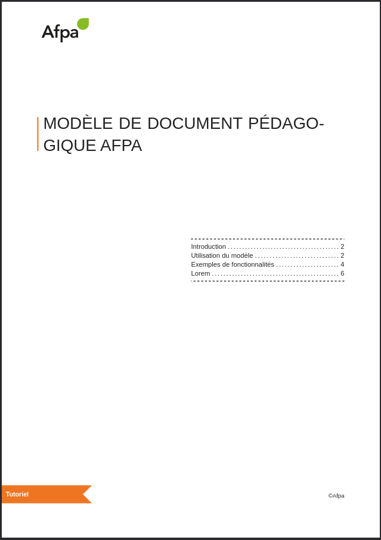

# Introduction

Template [typst](https://typst.app/) utilisable pour la génération de ressources pédagogiques de l'[Afpa](https://www.afpa.fr/).

Pour apprendre les bases de la rédaction d'un document vous pouvez vous référer à ces différents tutoriels :
- [tutoriel officiel](https://typst.app/docs/reference/syntax/)
- [utilisation de typst par l'exemple](https://sitandr.github.io/typst-examples-book/book/basics/tutorial/markup.html)




# Utilisation du modèle

## Installation de typst

### Windows

Via Winget :
```bash
winget install --id Typst.Typst
```

### Linux

Vous pouvez consulter le site suivant afin de voir si typst est disponible pour votre distribution : [repology.org](https://repology.org/project/typst/versions).

### MacOS

Via Brew : 
```bash
brew install typst
```

## Ajout du "package" au système

Ce modèle est disponible sous un ["package typst"](https://github.com/typst/packages).

Pour rendre le package utilisable sur votre ordinateur une solution est de cloner ce dépôt dans le dossier suivant (sous Windows) :
```bash
%AppData%\Local\typst\packages\local\afpa-ressource\0.1.0
```

Avec `%AppData%` étant contenu dans le dossier utilisateur. 

## Création d'un nouveau document

Une fois le package dans le dossier cité précédemment, vous pourrez utiliser la commande suivante pour créer un nouveau document :
```bash
typst init @local/afpa-ressource:0.1.0 <nom-document>
```

Cette commande créera un nouveau dossier portant le nom du document.
